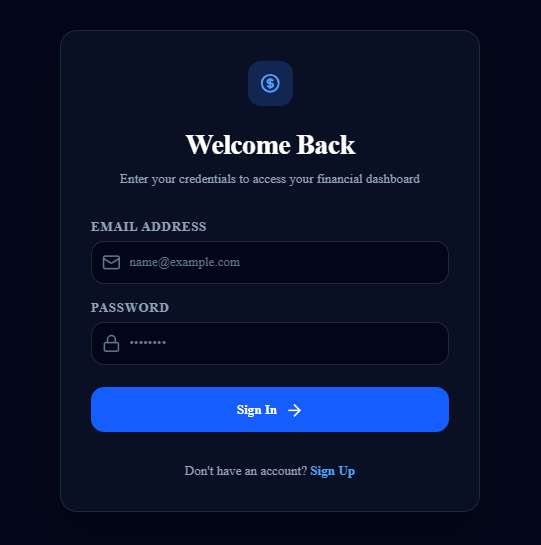
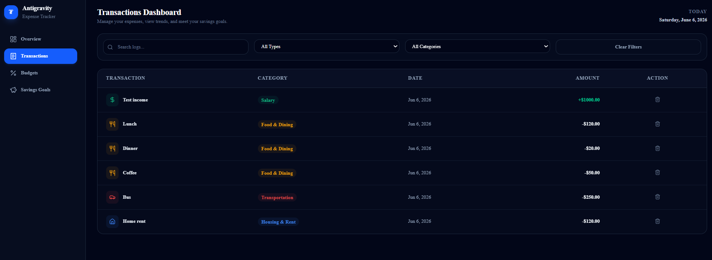

💰 Expense Tracker – Full Stack Finance Management App
A modern full-stack Expense Tracker application designed to help users manage income, expenses, and budgets with real-time tracking and a clean analytics dashboard.
Built using a scalable architecture with authentication, protected routes, and responsive UI.
🚀 Key Features
🔐 Authentication System
Secure login and signup system
Protected dashboard access
User-specific financial data
📊 Overview Dashboard
Real-time balance tracking
Total income vs expenses visualization
Clean summary cards for quick insights
➕ Quick Add Transaction
Fast input for income and expenses
Instant update to dashboard values
Simple and user-friendly form
📄 Transaction Management
View complete transaction history
Categorized income and expense records
Easy deletion of transactions
💰 Budget Dashboard
Set and monitor budget limits
Track spending vs budget usage
Helps maintain financial discipline
🛠️ Tech Stack
Next.js (App Router)
TypeScript
Tailwind CSS
Supabase (Auth + Database)
## 📸 Screenshots

### 🔐 Login Page

### 📊 Overview Dashboard

### ➕ Quick Add Transaction

### 📄 Transaction Dashboard

### 💰 Budget Dashboard

⚙️ Getting Started
Clone the repository:
Bash
git clone https://github.com/RishithGowdaP/expense-tracker.git
Install dependencies:
Bash
npm install
Run development server:
Bash
npm run dev
Open:

http://localhost:3000
🔐 Environment Variables
Create a .env.local file:
Environment
NEXT_PUBLIC_SUPABASE_URL=your_supabase_url
NEXT_PUBLIC_SUPABASE_ANON_KEY=your_supabase_anon_key
🌟 Project Highlights
Full-stack authentication system
Real-time financial tracking
Budget monitoring feature
Clean and responsive dashboard UI
Modular and scalable code structure
🚀 Future Improvements
📊 Advanced analytics with charts
💡 AI-based spending insights
📱 Mobile-first optimization
📤 Export transactions as PDF/CSV
👨‍💻 Author
Rishith Gowda P
📄 License
This project is for educational and portfolio purposes.