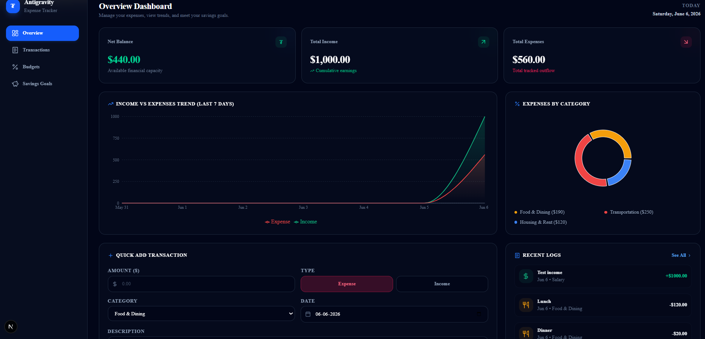

💰 Expense Tracker

A full-stack Expense Tracker application built with Next.js, TypeScript, Tailwind CSS, and Supabase. The application helps users manage income, expenses, transactions, and budgets through a clean and responsive dashboard.

🚀 Features

- 🔐 Secure Authentication (Login & Signup)
- 📊 Real-Time Dashboard Overview
- 💰 Income & Expense Tracking
- ➕ Quick Add Transactions
- 📄 Transaction Management
- 🎯 Budget Tracking Dashboard
- ⚡ Instant Balance Updates
- ☁️ Supabase Authentication & Database
- 📱 Responsive Design

🛠️ Tech Stack

- Next.js
- TypeScript
- Tailwind CSS
- Supabase
- Git & GitHub

📸 Project Preview

Dashboard displaying balance, income, expenses, transactions, and budget insights.

Additional screenshots are available in the "screenshots" folder:

- Login Page
- Quick Add Transaction
- Transaction Dashboard
- Budget Dashboard

⚙️ Installation

git clone https://github.com/RishithGowdaP/expense-tracker.git
cd expense-tracker
npm install
npm run dev

Open:

http://localhost:3000

🔐 Environment Variables

Create a ".env.local" file:

NEXT_PUBLIC_SUPABASE_URL=your_supabase_url
NEXT_PUBLIC_SUPABASE_ANON_KEY=your_supabase_anon_key

🌟 Future Enhancements

- AI-powered spending insights
- Monthly analytics dashboard
- Smart budget recommendations
- Export transactions to PDF/CSV

👨‍💻 Author

Rishith Gowda P